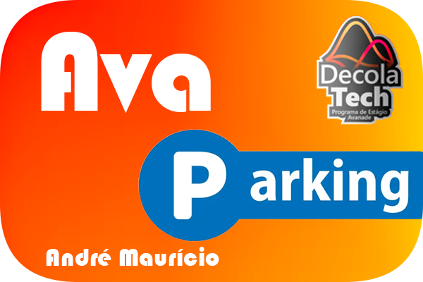

# AvaParking - Sistema de Estacionamentos integrado a Smartphones e Testes Unitários

<h1 align="center">
  
  </br>
</h1>

## Sobre

O AvaParking é uma melhoria do Sistema de Estacionamentos proposto por Leonardo Buta em seu curso de C# na plataforma DIO,
utilizado como base para o bootcamp DecolaTech4 da Avanade Brasil. Neste, foi integrado também o Sistema de Smartphones e Testes Unitários,
completando assim a implementação dos três projetos propostos pelo bootcamp.

## Recursos - AvaParking

- Sistema Completo de Estacionamento, com Capacidade Máxima e definição de preços e seguro de veículos por categoria;
- Listagem de Veículos protegida por Senha de Gerenciamento;
- Sistema de "Reconhecimento de Placas" (randomizador) para evitar inserção de dados sensíveis (placas possivelmente reais);
- Validador de Placas utilizando Expressões Regulares (Regex);
- Sistema de Consulta de Placas via API real ao DENATRAN com Serialização de JSON e Definição de Categoria por Inteligência Artificial (CHAT GPT-Turbo);
- Implementação do "BotPhone", uma instanciação da Classe Android : Smartphone que aciona a polícia caso a API retorne um veículo com restrição de roubo (Elo entre Sistemas);
- Opção de Inserção Manual de Categoria, podendo ser usada como recurso à falha no processo de requisição à APIs;
- Cálculo automático do preço do serviço, por fração de hora, utilizando comparativo de DateTime de entrada e DateTime.Now, com tolerância de 15 minutos;
- Opção de Pagamento via "AvaParking App", com instanciação de aparelhos Android : Smartphone e Iphone : Smartphone.

## Recursos - Smartphones

- Sistema de Smartphones com Número, Modelo, IMEI, Memória, Lista de Aplicativos e BlackList da Anatel;
- Interface gráfica utilizando caracteres UTF-8 e posicionamento de cursor do console;
- Sistema de Instalação de aplicativos conforme disponibilidade de memória;
- Implementação de Sistema de Comunicação de Perda/Roubo, com inserção do número do IMEI do aparelho na "BlackList Anatel";
- Método Ligar() dependente de não constância do aparelho junto à BlackList da Anatel;
- Possibilidade de pagar o estacionamento utilizando o app AvaParking (não certificado).

### Recursos Exclusivos em Iphone

- Sistema de verificação de autenticidade do App a ser instalado;
- Implementação de arriscadíssimo (10% de chance de sucesso) método de JailBreak que permite instalar aplicativos não certificados (AvaParking).

#### Atenção! JailBreak é uma prática ilegal e não deve ser realizada. Aqui mimetizado apenas para fins de demonstração de métodos randômicos e validação de métodos, além de ser ilegal, pode danificar seriamente seu aparelho, como descrito e aqui também demonstrado.


## Pré-requisitos

- [.NET SDK ](https://dotnet.microsoft.com/download) instalado.
- Conexão com a Internet para funcionalidades avançadas envolvendo APIs.

## Instalação

1. Clone o repositório:

   ```bash / terminal
   git clone https://github.com/andremagalhaesdev/entrevista-avanade.git
   cd entrevista-avanade
   cd EntrevistaAvanade

   ```

2. Execute o código:

   ```terminal
   dotnet run
   ```

## Como Usar

- Siga as instruções na interface de linha de comando para interagir com o sistema.

## Diagrama de Classes

<h1 align="center"> 
  
  </br>
</h1>

## Licença

O projeto não está sob nenhum tipo de licença e pode ser livremente copiado/utilizado para fins de estudo.
